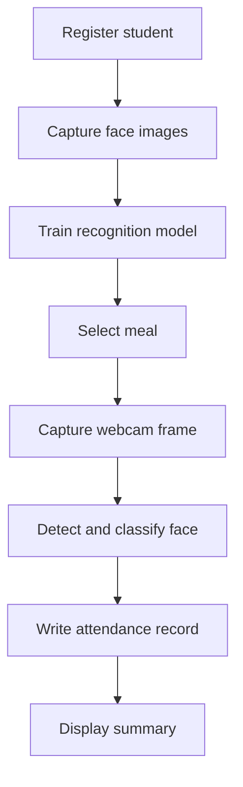

# Hostel Mess Attendance System

An educational Flask application for exploring face-recognition-assisted meal attendance in a hostel setting.

The application supports student registration, webcam-based face capture, model training, meal selection, attendance recording, and basic attendance summaries. Records are stored locally as CSV files.

> **Project status:** This repository is a prototype. Recognition accuracy, spoofing resistance, privacy controls, and operational reliability have not been validated for real-world deployment. It should not be used to make disciplinary, access, or eligibility decisions.

## Motivation

Meal attendance is often recorded manually, which can make it difficult to prepare timely attendance summaries and identify missing records. I built this project to learn how a computer-vision workflow could be connected to a small web application.

The main goals were to:

- Capture training images through a webcam.
- Train a classifier for registered students.
- Connect recognition results to meal-specific attendance records.
- Display attendance summaries through a Flask interface.
- Explore the limitations of biometric identification in an administrative workflow.

## How It Works



The application has two main workflows.

### Enrollment

1. An administrator enters a student's details.
2. The webcam captures multiple face images.
3. Images are stored in a student-specific directory.
4. The recognition model is retrained using the available enrollment images.
5. The trained model is saved locally.

### Attendance

1. An administrator selects breakfast, lunch, or dinner.
2. The webcam captures a face during the attendance session.
3. OpenCV detects the face region.
4. The trained classifier returns a predicted identity.
5. The application checks for an existing record for that meal.
6. A new record is written when the attendance entry is accepted.

## Implemented Features

- Hostel account registration and login
- Student profile registration
- Webcam-based collection of enrollment images
- Face detection with an OpenCV Haar cascade
- Local classifier training with TensorFlow/Keras
- Meal categories for breakfast, lunch, and dinner
- Duplicate-record checks within an attendance session
- Dashboard counts for registered, present, and absent students
- Date- and meal-based absentee views
- Local CSV attendance records
- HTML interface rendered with Flask and Jinja

## Technology Stack

| Area | Technology |
| --- | --- |
| Backend | Python, Flask |
| Face detection | OpenCV Haar cascade |
| Classification | TensorFlow, Keras |
| Data processing | pandas, NumPy |
| ML utilities | scikit-learn, joblib |
| Interface | HTML, Jinja, Bootstrap |
| Storage | Local directories and CSV files |
| Desktop packaging | PyInstaller, FlaskWebGUI |

## Project Structure

```text
Hostel-Mess-Attendence-system/
├── app.py
├── requirements.txt
├── init.sh
├── exec.sh
├── static/
│   ├── haarcascade_frontalface_default.xml
│   └── data/
│       ├── faces/
│       ├── Attendance/
│       ├── face_recognition_model.pkl
│       ├── login.info
│       └── ftype
└── templates/
    ├── signup.html
    ├── login.html
    ├── dashboard.html
    ├── adduser.html
    ├── attn.html
    └── absents.html
```

| Path | Purpose |
| --- | --- |
| `app.py` | Flask routes, attendance logic, and model workflow |
| `static/data/faces/` | Locally captured enrollment images |
| `static/data/Attendance/` | Date-based attendance CSV files |
| `static/data/face_recognition_model.pkl` | Serialized recognition model |
| `static/data/login.info` | Local login information used by the prototype |
| `static/data/ftype` | Selected meal category |
| `templates/` | Jinja templates for the web interface |

## Setup

### Prerequisites

- Python 3.8 or later
- A webcam accessible to OpenCV
- A local environment capable of installing TensorFlow and OpenCV

Clone the repository:

```bash
git clone https://github.com/dhyanagni2001-commits/Hostel-Mess-Attendence-system.git
cd Hostel-Mess-Attendence-system
```

Create and activate a virtual environment:

```bash
python3 -m venv .venv
source .venv/bin/activate
```

On Windows PowerShell:

```powershell
py -m venv .venv
.venv\Scripts\Activate.ps1
```

Install the dependencies:

```bash
python -m pip install -r requirements.txt
```

Run the application:

```bash
python app.py
```

Open the local address shown by Flask, normally:

```text
http://127.0.0.1:5000
```

Keep the application bound to localhost. The current prototype does not document the controls needed for safe public deployment.

## Application Routes

| Route | Method | Purpose |
| --- | --- | --- |
| `/` | `GET` | Selects the initial signup or login view |
| `/signup` | `POST` | Creates the local hostel account |
| `/login` | `POST` | Checks login information |
| `/dashboard` | `GET` | Displays attendance summaries |
| `/adduser` | `GET` | Displays student registration |
| `/add` | `POST` | Captures enrollment data and updates the model |
| `/startattn` | `GET` | Displays the attendance view |
| `/start` | `GET` | Starts the webcam attendance workflow |
| `/updateftype` | `GET` | Changes the selected meal category |
| `/absentees` | `GET`, `POST` | Displays filtered absentee records |

These routes describe the current prototype. State-changing operations should use appropriate HTTP methods and CSRF protection before the application is expanded.

## Local Data Format

Each enrolled student is represented by a directory under:

```text
static/data/faces/
```

Attendance records are written under:

```text
static/data/Attendance/
```

The current CSV schema includes fields such as:

| Field | Meaning |
| --- | --- |
| `Name` | Student name |
| `Roll` | Roll or registration number |
| `StudentNo` | Student contact number |
| `Time` | Attendance timestamp |
| `ParentNo` | Parent contact number |

Real personal information and face images should not be committed to the repository. Use synthetic records when demonstrating the project.

## Evaluation Status

The repository does not currently report a controlled evaluation of face-identification performance. The number of captured images or a successful demonstration is not an accuracy measurement.

A useful evaluation would use people and recording sessions that are separate from the model's training images. It should report:

- Identification accuracy for registered users
- False-accept rate for unknown users
- False-reject rate for registered users
- Performance across lighting, pose, distance, and camera quality
- A confusion matrix by identity
- Inference latency on the target computer
- Results for repeated observations of the same person

Performance should also be checked across different demographic groups. Any evaluation involving real people requires consent and appropriate handling of biometric data.

## Design Tradeoffs

### Haar-Cascade Detection

Haar cascades are lightweight and easy to run on a CPU. They can be sensitive to lighting, head angle, partial occlusion, and image quality compared with more recent detectors.

### Custom CNN Classification

A small local classifier makes the training process visible and avoids an external recognition service. Retraining as students are added becomes expensive, and the model may learn the enrollment environment instead of identity-specific features.

### Local CSV Storage

CSV files make records easy to inspect during development. They do not provide transactions, concurrent-write protection, access control, relational constraints, or reliable migrations.

### File-Based Login

A local file is simple for a prototype but is not an appropriate credential store. A deployed version would require password hashing, session hardening, authorization, secure recovery, and audit logs.

### Contact Details in Directory Names

Encoding personal details in paths simplifies lookup but exposes information through filenames, logs, backups, and error messages. Student identifiers and contact data should instead be stored in an access-controlled database.

### Automated Recognition

Recognition can reduce manual entry, but a false match can create an incorrect attendance record. A practical workflow needs confirmation, manual correction, and a non-biometric alternative.

## Privacy, Safety, and Security

Face images are biometric data, and student and parent phone numbers are personal information. Before any use beyond a local demonstration:

- Obtain informed consent before collecting face images.
- Explain the purpose, retention period, and deletion process.
- Provide a reasonable non-biometric attendance option.
- Do not collect parent contact details unless they are necessary.
- Store profiles, images, and attendance records outside public static directories.
- Replace file-based credentials with hashed passwords in a database.
- Add authentication and role-based authorization to protected routes.
- Add CSRF protection to state-changing requests.
- Encrypt sensitive data at rest and in transit.
- Define automatic retention and deletion policies.
- Add audit records for enrollment, recognition, edits, and exports.
- Add liveness or anti-spoofing checks before relying on camera input.
- Allow administrators to review and correct recognition results.
- Never use a recognition result as the sole basis for disciplinary action.

## Known Limitations

- Recognition quality has not been measured on a held-out test set.
- The system does not document liveness or photo-spoofing detection.
- The custom model may not generalize beyond the enrollment environment.
- CSV storage is not suitable for concurrent or multi-user operation.
- Credentials and sensitive records require stronger protection.
- Retraining after enrollment does not scale well to many students.
- Camera capture depends on local hardware and lighting.
- Automated tests are not documented.
- A manual correction and appeal workflow is not documented.
- Packaging scripts should be reviewed before execution because generated data may be removed during a build.

## Possible Improvements

- Replace personal data in directory names with generated student IDs.
- Move student and attendance records to PostgreSQL or SQLite.
- Store password hashes instead of raw login information.
- Add role-based access control and CSRF protection.
- Add unit, route, and integration tests.
- Separate enrollment, training, inference, and persistence modules.
- Add a held-out evaluation dataset and reproducible metrics.
- Add unknown-person rejection and configurable confidence thresholds.
- Add liveness detection and duplicate-frame protection.
- Add manual confirmation and attendance-correction workflows.
- Add data export, deletion, and retention controls.
- Pin and audit dependencies in a reproducible environment.

## What I Learned

This project helped me connect a Flask application with webcam input, OpenCV face detection, TensorFlow model training, local persistence, and an administrative dashboard.

It also highlighted that implementing a recognition pipeline is only one part of an attendance system. Reliable deployment requires evaluation, privacy controls, secure data storage, anti-spoofing measures, and a process for correcting mistakes.
